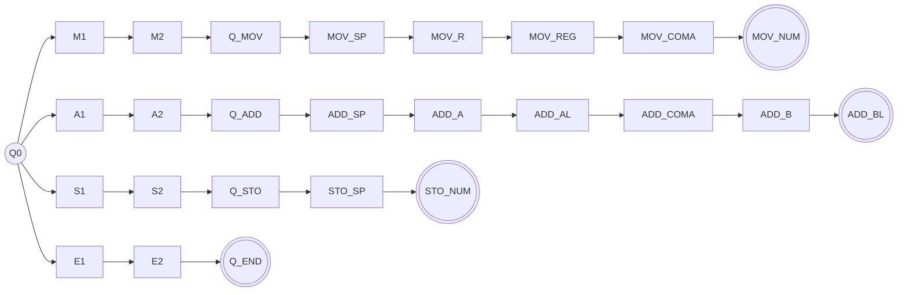

# Hands-on 1: Análisis Léxico y Autómatas
**Registro técnico de la solución**

- **Profesor:** José Antonio Aviña Méndez
- **Alumno:** Alondra Goretti Gonzalez Martinez
- **Fecha:** 23 de septiembre del 2026
- **Archivos:** `hands_on1.cpp` (núcleo en C++), `index.html` (interfaz web)

---

## 1. Objetivo

Recibir una instrucción del ISA de referencia, validarla con un AFD, construir el objeto instrucción y generar con una máquina de Moore la secuencia de microoperaciones, sin ejecutarlas. Si la instrucción es inválida, se imprime el error y no se genera nada más.

Flujo general:

```
texto ──► AFD (tokens) ──► objeto instrucción ──► Moore (microoperaciones)
             │ error
             └──► mensaje de rechazo (fin del proceso)
```

## 2. Arquitectura e ISA

| Componente | Función |
|---|---|
| `AL`, `BL` | Registros de operandos |
| `ACC` | Acumulador (resultado de la suma) |
| `MAR` | Dirección de memoria en uso |
| `MBR` | Dato leído de o escrito en memoria |
| `M[d]` | Contenido de memoria en la dirección `d` |

| Instrucción | Operandos | Significado | Microoperaciones |
|---|---|---|---|
| `MOV R, d` | `R` ∈ {AL, BL}; `d` decimal ≥ 0 | R ← M[d] | `MAR ← d`, `MBR ← M[MAR]`, `R ← MBR` |
| `ADD AL, BL` | AL y BL, en ese orden | ACC ← AL + BL | `ACC ← AL + BL` |
| `STO d` | `d` decimal ≥ 0 | M[d] ← ACC | `MAR ← d`, `MBR ← ACC`, `M[MAR] ← MBR` |
| `END` | ninguno | Detener | `HALT ← 1` |

Convenciones: mnemónicos y registros en mayúsculas; uno o más espacios tras el mnemónico; coma obligatoria en `MOV` y `ADD` (espacios opcionales a su alrededor); dirección de uno o más dígitos; sin operandos adicionales. El direccionamiento es directo: `MOV AL, 6` carga el contenido de `M[6]`, no el número 6.

## 3. Autómata Finito Determinista (AFD)

### 3.1 Definición formal

- **Alfabeto Σ:** letras mayúsculas usadas por los mnemónicos y registros (`M O V A D S T E N B L`), dígitos `0-9`, espacio y coma.
- **Estado inicial:** `Q0`.
- **Estados de aceptación F:** `Q_END`, `MOV_NUM`, `ADD_BL`, `STO_NUM`.
- **Estado de error:** implícito. Cualquier par (estado, carácter) sin transición rechaza la entrada.
- **Implementación:** la función δ es una tabla explícita (`vector<Regla>` con `de`, `c`, `a`) y `sig(estado, carácter)` la consulta. En la tabla, `' '` significa espacio y `'#'` significa cualquier dígito.

### 3.2 Tabla de transiciones

| Rama | Transiciones |
|---|---|
| Inicio | Q0 –M→ M1, Q0 –A→ A1, Q0 –S→ S1, Q0 –E→ E1 |
| Mnemónicos | M1 –O→ M2 –V→ **Q_MOV**; A1 –D→ A2 –D→ **Q_ADD**; S1 –T→ S2 –O→ **Q_STO**; E1 –N→ E2 –D→ **Q_END** |
| `MOV` | Q_MOV –␣→ MOV_SP (↻ ␣) –A/B→ MOV_R –L→ MOV_REG (↻ ␣) –,→ MOV_COMA (↻ ␣) –dígito→ **MOV_NUM** (↻ dígito) |
| `ADD` | Q_ADD –␣→ ADD_SP (↻ ␣) –A→ ADD_A –L→ ADD_AL (↻ ␣) –,→ ADD_COMA (↻ ␣) –B→ ADD_B –L→ **ADD_BL** |
| `STO` | Q_STO –␣→ STO_SP (↻ ␣) –dígito→ **STO_NUM** (↻ dígito) |
| `END` | Sin transiciones después de Q_END |

### 3.3 Diagrama



### 3.4 Tokens

Los tokens se emiten cuando el AFD completa un lexema (al leer un espacio, una coma o el fin de la cadena).

| Token | Estado que lo cierra | Ejemplo |
|---|---|---|
| `MOV`, `ADD`, `STO`, `END` | Q_MOV, Q_ADD, Q_STO, Q_END | `MOV("MOV")` |
| `REGISTRO` | MOV_REG, ADD_AL, ADD_BL | `REGISTRO("AL")` |
| `COMA` | MOV_COMA, ADD_COMA | `COMA(",")` |
| `NUMERO` | MOV_NUM, STO_NUM | `NUMERO("6")` |

### 3.5 Recorrido de ejemplo: `MOV AL, 6`

| Paso | Carácter | Transición |
|---|---|---|
| 1 | `M` | Q0 → M1 |
| 2 | `O` | M1 → M2 |
| 3 | `V` | M2 → Q_MOV |
| 4 | `␣` | Q_MOV → MOV_SP |
| 5 | `A` | MOV_SP → MOV_R |
| 6 | `L` | MOV_R → MOV_REG |
| 7 | `,` | MOV_REG → MOV_COMA |
| 8 | `␣` | MOV_COMA → MOV_COMA |
| 9 | `6` | MOV_COMA → MOV_NUM |
| fin | fin de cadena | MOV_NUM ∈ F → **ACEPTA** |

### 3.6 Mensajes de error

El mensaje depende del estado en que se detiene el AFD:

| Situación | Mensaje |
|---|---|
| Registro distinto de AL/BL en `MOV` | registro inválido: MOV solo admite AL o BL |
| Registro incorrecto en `ADD` | registro inválido: ADD requiere AL, BL en ese orden |
| Falta la coma (`MOV AL 6`) | falta la coma entre los operandos |
| Falta un componente al final | por ejemplo «falta el registro BL» o «falta la dirección de memoria en STO» |
| Sobran componentes | `END no admite operandos` o «sobran componentes al final de la instrucción» |
| Mnemónico inválido | carácter inesperado o mnemónico inválido (use MOV, ADD, STO, END en mayúsculas) |

## 4. Objeto instrucción

Se construye solo si el AFD acepta. Se llena a partir de la lista de tokens.

```cpp
struct Instr { string op; vector<string> regs; optional<string> dir; };
```

| Entrada | Objeto |
|---|---|
| `MOV AL, 6` | `{ operacion: "MOV", registros: ["AL"], direccion: 6 }` |
| `ADD AL, BL` | `{ operacion: "ADD", registros: ["AL","BL"], direccion: null }` |
| `STO 8` | `{ operacion: "STO", registros: [], direccion: 8 }` |
| `END` | `{ operacion: "END", registros: [], direccion: null }` |

## 5. Máquina de Moore

La clase `Moore` recibe únicamente el objeto instrucción y no vuelve a analizar el texto. Cada estado tiene una salida asociada. `siguientePaso()` emite la salida del estado actual y avanza, y el proceso termina en `Fin`, que no emite nada. La dirección se sustituye desde el objeto al imprimir `MAR ← d`.

| Instrucción | Ruta de estados (salida) |
|---|---|
| `MOV R, d` | Preparar dirección (`MAR ← d`) → Leer memoria (`MBR ← M[MAR]`) → Cargar R (`R ← MBR`) → Fin |
| `ADD AL, BL` | Sumar (`ACC ← AL + BL`) → Fin |
| `STO d` | Preparar dirección (`MAR ← d`) → Copiar ACC (`MBR ← ACC`) → Escribir memoria (`M[MAR] ← MBR`) → Fin |
| `END` | Detener (`HALT ← 1`) → Fin |

## 6. Arquitectura del software

| Módulo | Contenido |
|---|---|
| `R`, `sig()`, `tipo()`, `msg()` | Tabla de transiciones, consulta de δ, mapeo estado → token, mensajes de error |
| `procesar()` | Recorre la cadena carácter por carácter, guarda cada paso del AFD, emite tokens, arma el objeto y ejecuta Moore |
| `Moore` | Ruta de estados con su salida y `siguientePaso()` |
| `aJson()`, `imprimir()` | Salida en JSON (para la interfaz) y salida de texto con el formato del enunciado |
| `analizar()` | Función exportada a WebAssembly con Emscripten (con `#ifdef __EMSCRIPTEN__`) |

Este diseño separa el análisis, la construcción del objeto y la generación de microoperaciones. La misma implementación C++ sirve a la consola y a la interfaz web.

## 7. Interfaz web (`index.html`)

- **Grafo del AFD:** resalta el estado actual, marca los visitados y pone el estado en rojo si hay error. El carácter en proceso se subraya en la cadena.
- **Tokens y objeto instrucción:** aparecen progresivamente según avanza el recorrido.
- **Moore y datapath:** muestran la lista de estados con su salida y las cajas de registros y memoria. Se resalta el origen (magenta) y el destino (cian) de cada microoperación.
- **Reproductor:** botones Anterior, Siguiente y Reproducir, con control de velocidad.
- **Modo desafío:** ofrece 4 opciones para predecir el siguiente estado del AFD o la siguiente microoperación, con puntaje.
- **Valores de ejemplo:** la visualización usa AL=5, BL=7 y M[d]=(7d+3) mod 100 únicamente para ilustrar el flujo. El programa de la práctica no ejecuta las microoperaciones.

## 8. Compilación y ejecución

```bash
# Consola
g++ -std=c++17 -O2 hands_on1.cpp -o hands_on1
./hands_on1 "MOV AL, 6"          # salida de texto
./hands_on1 --json "STO 8"       # salida JSON

# Interfaz web (Emscripten)
emcc hands_on1.cpp -std=c++17 -O2 -o hands_on1.js -sEXPORTED_RUNTIME_METHODS=cwrap
python3 -m http.server 8000      # abrir http://localhost:8000/index.html
```

## 9. Casos de prueba

Resultados esperados según el diseño. **Pendiente:** reemplazar la columna «Evidencia» por capturas o la salida real de tu ejecución.

### 9.1 Entradas válidas

| Entrada | Tokens | Objeto | Microoperaciones | Evidencia |
|---|---|---|---|---|
| `MOV AL, 6` | MOV, REGISTRO(AL), COMA, NUMERO(6) | `{MOV, [AL], 6}` | `MAR ← 6`; `MBR ← M[MAR]`; `AL ← MBR` | _(captura)_ |
| `MOV BL, 7` | MOV, REGISTRO(BL), COMA, NUMERO(7) | `{MOV, [BL], 7}` | `MAR ← 7`; `MBR ← M[MAR]`; `BL ← MBR` | _(captura)_ |
| `ADD AL, BL` | ADD, REGISTRO(AL), COMA, REGISTRO(BL) | `{ADD, [AL,BL], null}` | `ACC ← AL + BL` | _(captura)_ |
| `STO 8` | STO, NUMERO(8) | `{STO, [], 8}` | `MAR ← 8`; `MBR ← ACC`; `M[MAR] ← MBR` | _(captura)_ |
| `END` | END | `{END, [], null}` | `HALT ← 1` | _(captura)_ |

### 9.2 Entradas inválidas

| Entrada | Dónde se detiene el AFD | Mensaje | Evidencia |
|---|---|---|---|
| `MOV AX, 6` | Estado `MOV_R`, carácter `X` (posición 5) | registro inválido: MOV solo admite AL o BL | _(captura)_ |
| `MOV AL 6` | Estado `MOV_REG`, carácter `6` (posición 7) | falta la coma entre los operandos | _(captura)_ |
| `ADD AL,` | Fin de cadena en `ADD_COMA` | falta el registro BL | _(captura)_ |
| `STO` | Fin de cadena en `Q_STO` | falta la dirección de memoria en STO | _(captura)_ |
| `END 8` | Estado `Q_END`, carácter `␣` (posición 3) | END no admite operandos | _(captura)_ |

En todos los casos inválidos no se construye el objeto ni se generan microoperaciones.

## 10. Cumplimiento de la rúbrica

| Criterio | Dónde se cumple |
|---|---|
| Estados y transiciones explícitos del AFD | Sección 3 y tabla `R` en `hands_on1.cpp` |
| Componentes correctos y objeto construido | Secciones 3.4 y 4 |
| Recorrido de estados de Moore con salidas | Sección 5 y clase `Moore` |
| Microoperaciones correctas y ordenadas | Sección 5 |
| Evidencias de ejecución | Sección 9 (por completar con capturas) |

## 11. Decisiones y limitaciones

- Los espacios al inicio y al final de la entrada se eliminan antes de pasar por el AFD.
- No se verifica que la dirección exista físicamente en memoria, como indica el enunciado.
- Las direcciones se guardan como texto de dígitos, por lo que no hay desbordamiento con números muy largos.
- El AFD es determinista. Cada rama del ISA tiene su propia cadena de estados, lo que hace explícito el orden de los componentes.
